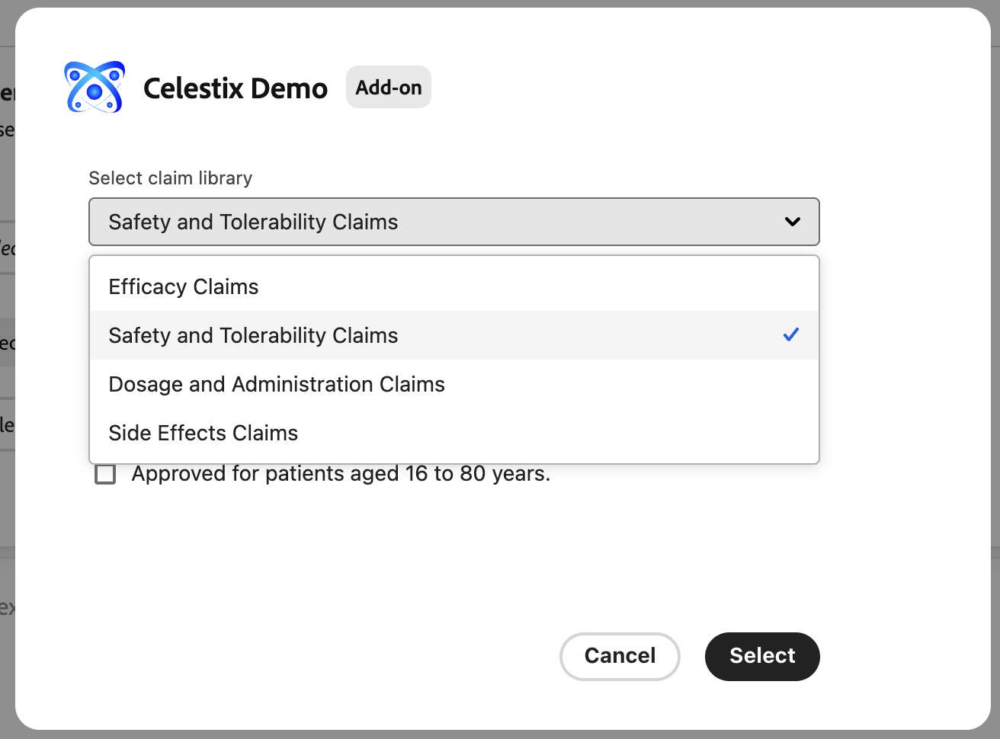
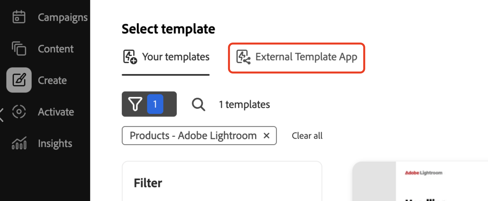

# Distribuera din app

När du kör din app får du en preliminär ögonblicksbild av din Add-ons beteende innan du distribuerar den. Detta kan vara till hjälp vid felsökning.

## Kör programmet

Kör appen i `https://localhost:9080`:

```bash
aio app run
```

## Distribuera appen

1. Navigera till arbetsytan Distribution:

   ```bash
   aio app use -w [deployment_workspace]
   ```

2. Distribuera appen:

   ```bash
   aio app deploy
   ```

## Tvinga omdistribution

Du kan tvinga fram ett bygge och en distribution av ditt program utan att skicka in det igen för godkännande.

>[!NOTE]
>
>Om du framtvingar en programkonstruktion och distribution skrivs din befintliga distribution över. **Testa appen** noggrant i en testmiljö först.

```bash
aio app build --force-build
```

```bash
aio app deploy --force-deploy
```

## Bygg och driftsätt samtidigt

```bash
aio app deploy --force-build --force-deploy
```

## Hitta din nya app

Efter distributionen kan du visa det nya programmet i GenStudio for Performance Marketing.

### Visa med en URL

Visa det nya programmet genom att lägga till en `query`-parameter i GenStudio for Performance Marketing URL:

```txt
https://experience.adobe.com/?ext=https://<my-deployed-add-on>.adobeio-static.net/index.html#/@<ims-org>/genstudio/create
```

### Visa i användargränssnittet

Nya tillägg hittas på olika platser i användargränssnittet, beroende på vilken typ av tillägg du distribuerade. De tillgängliga tilläggspunkterna är:

* Utökning av regelefterlevnad, som omfattar:
   * [*prompta tilläggspunkter*](#find-prompt-extensions) som gör att kunder kan lägga till ytterligare kontext i LLM-generering, och
   * [*valideringstillägg*](#find-validation-extensions), som gör att kunder kan validera det genererade innehållet från LLM. Valideringen är ofta kopplad till tillägget Fråga för att säkerställa att innehåll som genereras i ett utökat ärende uppfyller kundens krav (t.ex. medicinska läkemedelsanspråk eller juridiska krav)
* [DAM-tillägg (Digital Asset Management)](#find-dam-extensions)
* [Malltillägg](#find-template-extensions)
* [Översättningstillägg](#find-translation-extensions)

### Sök efter prompttillägg

Frågetillägg finns i listrutan **Tillägg** i avsnittet **parametrar** i en mall.

{width="600" zoomable="yes"}

Dialogrutan för tillägg öppnas så att du kan välja vilken ytterligare kontext som ska läggas till för LLM-genereringen.

{width="600" zoomable="yes"}

### Sök efter valideringstillägg

Valideringstillägg hittar du efter en promptgenerering, i den högra sidenav som visas med resultatet.

{width="600" zoomable="yes"}

Kör det tillägg som du har valt för att validera det genererade innehållet.

{width="600" zoomable="yes"}

### Sök DAM-tillägg

DAM-tillägg (Digital Asset Management) hittades när du väljer innehåll i **parameteravsnittet** för en mall. Titta längst ned i listrutan **Välj plats** för att se eventuella tillägg.

{width="600" zoomable="yes"}

### Sök efter malltillägg

Malltillägg finns på fliken **Extern mallapp** när du väljer en mall. Fliken visas bara när det finns mallappar att välja.

{width="600" zoomable="yes"}


### Sök översättningstillägg

Använd översättningstilläggspunkter för att få en egen översättningstjänst via en proxy i stället för att använda GenStudio standardöversättning.
Det finns ingen gränssnittsplats för dessa tillägg.

Om tillägget är registrerat används den tillhandahållna översättningstjänsten. I annat fall används GenStudio standardöversättningstjänst.


Om du är nöjd med din add-on kan du distribuera den utan parametern `query`.

Nu kan du [distribuera din app](distribute-app.md).
