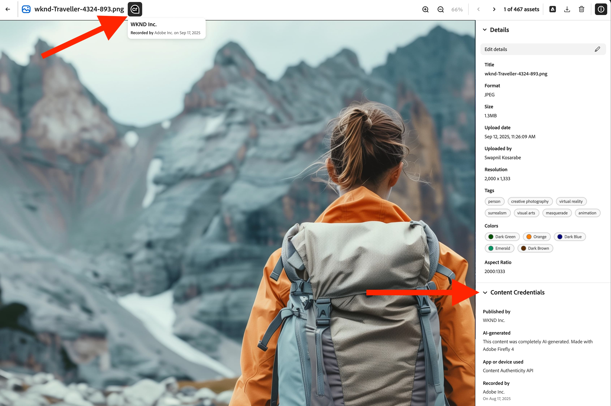
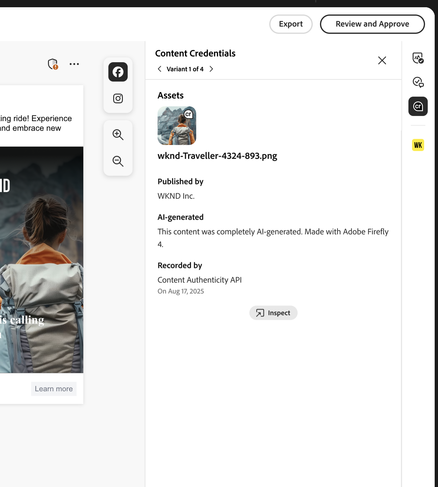

# Content Credentials för företag

Lär dig hur manipuleringssäkra autentiseringsuppgifter för innehåll som bevisar varumärkets autenticitet och ökar regelefterlevnaden bäddas in direkt i ert marknadsföringsarbetsflöde.

>[!WARNING]
>
> Den här funktionen är för närvarande i betaversion och är endast tillgänglig för organisationer som har fått åtkomst. Om du är intresserad kontaktar du Adobe kontoteam eller [använder den här länken för att begära registrering](https://www.feedbackprogram.adobe.com/c/a/5aWPEOthrDv22Mf9CyekOy?source=qr).

## Kom igång med Content Credentials

När Content Credentials har aktiverats i Admin Console kan GenStudio for Performance Marketing-användare aktivera Content Credentials för alla mediefiler globalt i appen. Om det globala alternativet att använda inloggningsuppgifter är inaktiverat kan användarna välja att använda Content Credentials för varje enskild resurs.

När innehållet har publicerats visas Content Credentials på externa plattformar, som LinkedIn.

Administratörer ansvarar för att överföra ett giltigt X.509-certifikat inom Admin Console. Detta steg säkerställer att företagets digitala signatur är korrekt konfigurerad och klar att användas i Adobe DX-program som stöds.

>[!NOTE]
>
>Kontroll över detta kan leda till en övergång till Admin Console i framtiden, effektivisera hanteringen av Content Credentials i olika program och förbättra den administrativa tillsynen.

## Vad är Content Credentials? 

Content Credentials är en hållbar, branschledande typ av metadata med information om hur innehåll har skapats och identitetsinformation om skaparna. Content Credentials kan visas när innehållet publiceras online på olika plattformar eller med verktyg som [Adobe Inspect ](https://contentauthenticity.adobe.com/inspect) eller [Adobe Content Authenticity Chrome-webbläsartillägget](https://helpx.adobe.com/creative-cloud/help/cai/adobe-content-authenticity-chrome-browser-extension.html).  

Genom att använda Content Credentials kan du öka genomskinligheten i hur innehåll har skapats och hjälpa dina användare att ansluta sig till sitt innehåll.

[Läs mer om Content Credentials](https://helpx.adobe.com/creative-cloud/help/content-credentials.html) på Adobe.

## Varumärkessignatur och tillgångsspårning

Varumärkessignerat innehåll spelar en viktig roll när det gäller att främja varumärkesintegritet och användarförtroende. Organisationer kan signera sitt innehåll med en unik varumärkessignatur i Adobe-program när deras certifikat är korrekt konfigurerat i Admin Console. Denna äkthetssäkring upprätthålls med osynliga vattenstämplar och fingeravtryckstekniker, som bevarar signaturens varaktighet under hela innehållets livscykel.

Förutom varumärkessignering kan företag bifoga tillgång-ID:n direkt till sitt innehåll. Detta underlättar en effektiv spårning av resurser, särskilt när de delas eller publiceras på plattformar för sociala medier. Genom att införliva tillgångs-ID:n kan organisationer spåra innehållets ursprung och distributionssätt, vilket förbättrar tillsyn och ansvar.

## Content Credentials i marknadsföringsarbetsflödet

Content Credentials kan användas genom hela marknadsföringsflödet direkt i GenStudio for Performance Marketing, från import- och innehållsidentifiering till aktivering och export. Du hittar även inloggningsuppgifter som visas i innehållet för granskning i hela programmet.

### Import och identifiering

I innehållsgalleriet visas inloggningsuppgifter för importerade resurser.

Content Credential-märket i det övre högra hörnet av miniatyrbilden visar&quot;Varumärkessignerat&quot; innehåll.

Om du väljer signerat innehåll visas detaljerade metadata: publicerat varumärke, inspelare, använt verktyg, tidsstämpel.

Innehåll kan filtreras efter autentiseringsstatus.

### Skapa och markera

Content Credential-emblem visas i resursväljaren för arbetsytan.

Metadata för autentiseringsuppgifter bevaras när resurser väljs för upplevelser för att bevara källkedjan under redigeringen.

### Redigera och omforma

Vid export från ett utkast signeras ändrade resurser om automatiskt och de nya autentiseringsuppgifterna länkar till originalet.

{width="60%"}

### Granskning och godkännande

I förhandsgranskningen för Granska och godkänn visas autentiseringsstatus för resurser till höger.

{width="60%"}

Autentiseringsuppgifter per variant visas när granskarna inspekterar resurserna. Godkända upplevelser signeras om när användare klickar på **[!UICONTROL Save to Content]**.

### Aktivering och export

Under aktiveringen visas autentiseringsstatusen i Experience selector.

{width="60%"}

Exporterade filer kommer att ha inbäddade C2PA-kompatibla autentiseringsuppgifter.

Autentiseringsuppgifternas integritet bevaras i alla format som stöds (JPEG, PNG, MP4).

