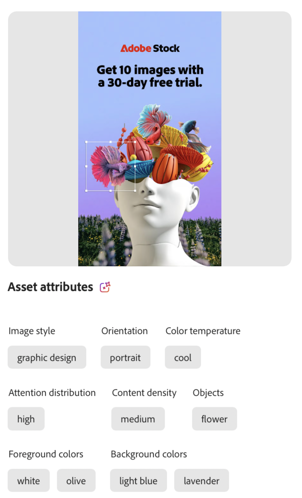

# Attributkategorier

En attributkategori är en klassificeringsgrupp som organiserar relaterade attribut som har en gemensam egenskap. Dessa kategorier hjälper till att effektivisera identifiering, identifiering och förståelse av specifika attribut genom att ge ett större sammanhang och underlätta deras tillämpning och användning.

GenStudio for Performance Marketing använder Adobe AI och maskininlärningsfunktioner för att studera bilder, videor och text och tillämpar [!UICONTROL Asset attributes] baserat på konfidensnivån. _Förtroende_ refererar till sannolikheten att AI tilldelar en förutsägelse eller klassificering. När det gäller maskininlärning är det en sorts poängsättning som mäter hur säker AI är att klassificeringen är korrekt. Ju högre förtroende, desto större säkerhet. När du till exempel analyserar en bild kan AI identifiera flera funktioner och tilldela en poäng till varje bild som anger hur säker funktionen är. Attributlistan för en tillgång är inte uttömmande. Assets som innehåller en mängd funktioner kan begränsas till ett tröskelvärde, t.ex. de tre dominerande funktionerna som identifieras.

## Bildfunktioner

Bildfunktioner representerar distinkta och informativa element eller mönster i en bild som används för analys med [!DNL Insights]. I följande tabell visas de bildfunktionskategorier som känns igen av GenStudio for Performance Marketing AI.

<!-- For the writer: turn off word wrap to work with these tables. Option + Z -->

| Kategori | Beskrivning | Exempel |
| ----------------------- | ----------------------------------------------------------------------------------------------------- | ------------------------------------------------------------------------------------------------------------------------------------------------------------------------------ |
| Kameravinkel | Kamerans placering och vinkel i förhållande till motivet. |                                                                                                                                                                                |
| Objektets avstånd | Avståndet mellan kameran och motivet i en bild. | `close up`, `mid shot`, `long shot` |
| Kamerainställning | Konfigurationen av kamerans kontroller för att skapa bilden. |                                                                                                                                                                                |
| Färg och ton | Utvärderar färger som används i bildelement. Identifierar en till tre färger från en uppsättning med 40 förbestämda färger i följande bildlager: **[!UICONTROL Foreground colors]**- element i bildens **[!UICONTROL Background colors]** främre lager - element i bildens baksta lager
**[!UICONTROL Color temperature]** beskriver den allmänna värmen eller färsheten för färgerna i bilden. Ton- eller temperaturvärden: `warm`, `cool`, `neutral` | {width="200" zoomable="yes"} |
| Bildformat | Visuell behandling av en bild. |                                                                                                                                                                                |
| Ljusvillkor | Typ av ljus i en bild. |                                                                                                                                                                                |
| Objekt | Identifierar ett eller flera objekt, enheter och element som utgör bilden. | {width="200" zoomable="yes"} |
| Orientering | Bildens position i förhållande till proportionerna. | `landscape`, `portrait`, `square` |
| Folk | När det finns minst en person kan ett eller flera attribut beskriva personen eller personerna i bilden. | {width="200" zoomable="yes"} |
| Fotografigenrer | Identifierar motivet och tekniken som används för att hämta en bild, till exempel `abstract` eller `landscape` (inte detsamma som liggande orientering). |           |
| Scener | Identifierar inställningen eller miljön som avbildas i en bild. |                                             |
| Taggar | Identifierar objekt, element och andra bildegenskaper som inte omfattas av en viss klassificering. |                                      |

<!-- Not yet approved by legal
| Attention distribution  | The level of viewer attention spread across an image.                                                 | `high`, `medium`, `low`                                                                                                                                                                                                    |
| Content density         | The amount of information or detail in an image.                                                      | `high`, `medium`, `low`                                                                                                                                                                                                    |
-->

## Videofunktioner

Bildfunktionerna representerar distinkta och informativa element, ljud eller mönster i en video för analys med [!DNL Insights]. I följande tabell visas de videofunktionskategorier som känns igen av GenStudio for Performance Marketing AI.

| Kategori | Beskrivning | Exempel |
| ------------------- | ------------------------------------------------------------------------------------------------------------ | --------------------------------------------------------------------------------------- |
| Ljudgenre | När det finns musik kan videon få en klassificering av musikstil, till exempel `electronic` eller `classical`. |          |
| Kategori för ljudgenre | När musik finns kan videon få en bred klassificering av musikgenre, som `acoustic` eller `traditional`. |          |
| Ljudläge | Beskriver den allmänna atmosfären eller tonen i ljudet, till exempel `relaxing` eller `energetic`. |          |
| Ljudtyper | När det finns ljud kan videon få en tagg för en eller flera ljudtyper, som `music` eller `speech`. |          |
| Objekt | Identifierar ett eller flera objekt, enheter och element som visas i videon. | {width="200" zoomable="yes"} |
| Orientering | Videons position i förhållande till bildrutans proportioner. | `landscape`, `portrait`, `square` |
| Folk | När det finns minst en person kan ett eller flera attribut beskriva personen eller personerna i videon. |        |
| Scener | Inställningen eller miljön som visas i videon. |        |
| Stilar | Identifierar visuella bearbetningar som används för element i videon, till exempel `matte` eller `neon`. |        |
| Taggar | Identifierar objekt, element och andra videoegenskaper som inte omfattas av en viss klassificering. |        |

## Textfunktioner

Textfunktioner inkluderar antal för vissa textelement, t.ex. ord, meningar, känslolägesikoner och klassificeringar för semantik, känslor och ton som används för analys med [!DNL Insights]. Texten kan också få ett läsbarhetspoäng. Kommer snart.

<!-- Not yet approved by legal

The following table lists the image feature categories recognized by the GenStudio for Performance Marketing AI.

| Category             | Description | Example |
|----------------------|-------------|--------|
| Emojis Count         |             |        |
| HashTags Count       |             |        |
| Keywords             |             |        |
| Marketing Emotions   |             |        |
| Narratives           | Text that represents an overarching situation, theme, or a story. Narratives can communicate values, purpose, or identity that resonates with consumers on many levels.   |        |
| Persuasion Strategies|             |        |
| Readability          |             |        |
| Tone of voice        | | |
-->
