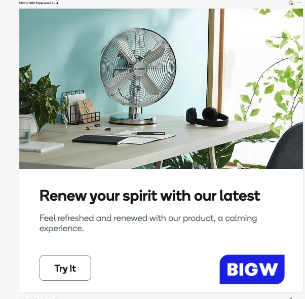

# Riktlinjer för annonseringsmallar

Visningsmallar är fördesignade layouter som används för att skapa visuellt engagerande banners och displayannonser. De utgör ett flexibelt ramverk för att införliva bilder, text och call to action, vilket ger enhetlighet och effektivitet vid produktion av olika annonsvarianter. När du förbereder mallen för användning i GenStudio for Performance Marketing måste du se till att alla resurser är optimerade för webbvisning och att de uppfyller de filformat och storlekar som krävs.

Följ de här designmetoderna när du anpassar mallar för banners och displayannonser så att de fungerar med GenStudio for Performance Marketing:

- Använda Adobe- eller Google-teckensnitt
- Förbered resurser som visas bra i tunna dimensioner
- Exakt ett bildfält krävs
- Använd **inte** inbäddade eller kodade bakgrundsbilder
- Använd bakgrundsbilder (`image` fält) som har överförts till GenStudio for Performance Marketing innehållsdatabas. Följ riktlinjerna i [Överför bilder för visningsannonser](#uploading-images-for-display-ads) för bästa resultat
- Använd **inte** JavaScript
- Endast ett avsnitt kan användas och en uppsättning mallelement genereras

## Identifierade fältnamn

När du anpassar din banderoll eller mall för att visa och visa innehåll använder du platshållare för följande obligatoriska fält:

- `headline`
- `sub_headline`
- `body`
- `image` (obligatoriskt, markerat från JPEG, PNG eller GIF)

GenStudio for Performance Marketing genererar automatiskt följande fält. Du behöver inte använda platshållare för innehåll för:

- `cta`

Mer information om hur du använder fältnamn i mallar finns i [Innehållsplatshållare](/help/user-guide/content/customize-template.md#content-placeholders) .

## Dimensioner som stöds

Bredd x höjd (pixlar) måste anges.

| Orientering | Mått (pixlar) | Anteckningar |
|--------------|-------------------------------------------------------------|------------------------------------------------------------------|
| Lodrätt | 300 x 600 160 x 600 | Vanligt för skyskrapa och halvsidesbanners. |
| Vågrät | 300 x 250 728 x 90 336 x 280 320 x 50 970 x 250 | Standardstorlekar för rankningspanel, medelstor rektangel och banderoll. |
| Egen | 50 x 50 till 2 000 x 2 000 | Använd för icke-standardiserade eller unika placeringar; kontrollera plattformsbegränsningar. |

## Överföra bilder för displayannonser

Bilder som används i visningsannonser ska komma från innehållsdatabasen och måste överföras korrekt för att bilden ska visas korrekt i mallen.

När en visningsmall innehåller en bild som löper från kant till kant (helt utfall) ändras storleken automatiskt på den markerade bilden så att den passar de fullständiga malldimensionerna. Om bilden inte matchar mallens proportioner beskärs bilden så att den passar mallens dimensioner och visas eventuellt inte som förväntat.

Det finns ingen autopassningsfunktion för bilder i mallar för displayannonser.

För att lösa bildbeskärning måste användarna definiera bildens proportioner i mallen när den överförs till innehållsdatabasen. När du överför en godkänd mall för displayannonsering:

1. [Fortsätt genom mallöverföringsprocessen](/help/user-guide/content/use-templates.md#add-a-template) tills du når sidan **[!UICONTROL Add details]**.

1. Definiera bildens proportioner som ska användas i mallen i **[!UICONTROL Ad width (px)]** och **[!UICONTROL Ad height (px)]**. Detta definierar bildfönstret för den del av mallen som visar bilden.

1. I avsnittet **[!UICONTROL More details]** markerar du listrutan **[!UICONTROL Image size]** och väljer _Beskär till en fast storlek_.
   {width="80%"}

Så här avgör du en bilds storlek och proportioner i webbläsaren:

1. Granska bilden.
   - Windows/Linux:
      - Tryck på F12.
   - macOS:
      - Tryck på Kommando + Alt + I.

1. Hovra över bilden.

1. Observera proportionerna. Använd detta för att definiera bildens proportioner i mallen.

När dessa detaljer inte används vid överföring antas bilden vara mallens hela proportioner och bilder som inte matchar proportionerna visas som beskurna.

{width="60%"}

**❌Beskuren bild i en visningsannonsmall**

{width="60%"}

**✅Bilden visas helt**
